Facultad de Ingenierías y TIC

Manejo de memoria con paginación

BIT-22 Sistemas Operativos I

Profesor:

Carlos Andrés Méndez

Integrantes:

Weslin Mena Montero (20190110862 / Ing. de Software)

Jose Miguel Chaves Miranda(200301010857 /Ing. de Software)

San José, 13 de Agosto de 2020

# Introducción

Con el aumento de poder de procesamiento de los ordenadores, y el incremento
exponencial en la complejidad de los programas que estos ejecutan, se volvió
necesario crear técnicas más eficientes y seguras de manejar la memoria, que no
solo permitan aprovechar el potencial del hardware disponible sino que también
preserven la integridad de los datos y prevengan daños al sistema.

Por esta razón aparecieron las direcciones lógicas de memoria y técnicas de
manejo de memoria virtual, de entre las que destaca la paginación.

Utilizando el lenguaje de programación C++, se pretende crear una representación
del funcionamiento de la paginación, a fin de poder observar en un entorno
aislado de qué forma esta maneja los recursos disponibles.

# Objetivo General

Mostrar la forma en que la paginación ayuda a manejar la memoria de un sistema
computacional.

# Objetivos específicos

-   Crear un programa que contenga las rutinas utilizadas por los sistemas de
    paginación para realizar sus funciones

-   Observar de qué manera la paginación se complementa con técnicas de swapping
    para aumentar su efectividad

-   Visualizar como el uso de paginación ayuda a mitigar el problema de
    fragmentación externa en la memoria

**¿Qué es la paginación?**

Es un esquema de manejo de memoria que elimina la necesidad de asignar memoria
física a los programas de forma continua.

En la MMU(memory management unit) se da el mapeo de direcciones virtuales a
físicas; esta es una pieza de hardware que utiliza el almacenamiento secundario
como memoria virtual para cargar los procesos que no caben en la RAM, esto con
el fin de posibilitar tener un mayor número de procesos corriendo a la vez, esto
a través de la combinación de la paginación con técnicas de swapping.

**Conceptos a saber**

**Dirección lógica**:Dirección generada por la CPU, está representado en bits.
Se divide en:

>   **número de página**: Los bits que representan una página del espacio de
>   direcciones lógico

>   **offset de página**: Los bits que representan una palabra en particular a
>   la que se necesita acceder

**Espacio de direcciones lógicas**:El conjunto de direcciones lógicas generadas
por un programa. Se divide en bloques de tamaño fijo llamados páginas y está
representado en palabras.

**Dirección física:** Dirección disponible en la unidad de memoria, está
representada en bits. Se divide en:

>   **número de marco**: Los bits que representan un marco del espacio de
>   direcciones físicas

>   **offset de marco:**Los bits que representan una palabra en particular a la
>   que se necesita acceder

**Espacio de direcciones físicas:** El conjunto de las direcciones físicas y sus
direcciones lógicas correspondientes.Se divide en bloques de tamaño fijo
llamados marcos, representados por palabras;pueden tener un tamaño de 4KB a 2MB,
y en el caso de servidores, incluso de GB.

**Fallos de página**

Un fallo de página ocurre cuando el CPU necesita acceder a datos que no se
encuentra en la memoria principal, por lo que genera un fallo de página.

A pesar de lo que el nombre pueda sugerir, no es un error, sino que simplemente
es parte del funcionamiento normal del sistema.

Al generarse un fallo de página, el sistema operativo busca en la tabla de
páginas, si encuentra lo que necesita, lo manda a traer a la memoria principal
desde el swap, y si no, lo trae desde el almacenamiento secundario y registra la
ubicación en memoria donde lo va a almacenar en la tabla de páginas.

También existen los fallos de página menores, en los cuales los datos que se
necesitan sí están en la memoria, pero están asignados a otro proceso; en este
caso no es necesario acceder al disco.

Un ejemplo de fallos de página menores se da al abrir múltiples instancias de
una misma aplicación; puesto que con la primera instancia ya se había cargado el
ejecutable en memoria, no hace falta cargarlo de nuevo para iniciar la segunda
instancia. Esto ahorra tiempo y recursos al sistema.

**Traducción de direcciones lógicas a direcciones físicas**

1.  El CPU genera una dirección lógica compuesta por número de página y offset

2.  La tabla de páginas provee el número de marco correspondiente al número de
    página especificado

3.  El número de marco se combina con el offset de página para formar la
    dirección física

**Ventajas de la paginación**

1.  Permite almacenar partes de un proceso de forma discontinua

2.  Resuelve el problema de la fragmentación externa(que queden espacios entre
    procesos sin usar)

3.  Es relativamente fácil realizar swapping entre marcos y páginas del mismo
    tamaño

**Desventajas de la paginación**

1.  Provoca fragmentación interna(cuando una página es más pequeña que el marco
    al que hace referencia, lo que provoca que quede un espacio sin usar, aunque
    no suele ser demasiado grande).

2.  Existe la necesidad de mantener una tabla de páginas para cada proceso

3.  Incrementa el tiempo de acceso debido a la necesidad de traducir las
    direcciones

**Swapping**

Es una técnica que permite a un sistema operativo proveer más memoria a una
aplicación o proceso de la disponible en la RAM; cuando la memoria física está
llena, el sistema operativo puede optar por usar swapping para obtener memoria
adicional.

El swapping funciona a través del uso de memoria virtual(espacio en disco que
funciona como RAM), la cual provee recursos extra cuando estos son requeridos.
El espacio en disco usado para realizar swapping se conoce como swap space o
espacio de intercambio.

En WIndows este espacio de swap está representado por un archivo con extensión
.swp, mientras que en Linux se crea una partición de disco dedicada a este fin
en específico.

**Ventajas de usar swapping**

1.  Mayor memoria disponible , lo que permite que el sistema operativo sea capaz
    de manejar solicitudes que de otra manera no podría 

2.  Operaciones contiguas: La memoria del archivo o partición swap puede ser
    escrita de forma contigua, lo que permite tener tiempos de búsqueda menores.

3.  Optimización del sistema: Procesos de menor importancia y requisitos pueden
    ser relegados a la memoria swap, guardando así la memoria física para
    operaciones con mayor valor.

**Limitaciones**

1.  La velocidad del almacenamiento secundario no es tan rápida como la RAM, lo
    que implica que esta memoria virtual sea una de menor rendimiento

2.  Limitaciones del disco: Los archivos swap dependen de la estabilidad y
    disponibilidad de un medio de almacenamiento, que probablemente no tiene la
    misma estabilidad que la memoria de sistema

3.  Capacidad: La memoria disponible para realizar swapping está limitada por el
    espacio designado para esto, ya sea por el tamaño de la partición swap, o
    porque se haya definido un tamaño máximo para el archivo swap.

Estructuras a utilizar:

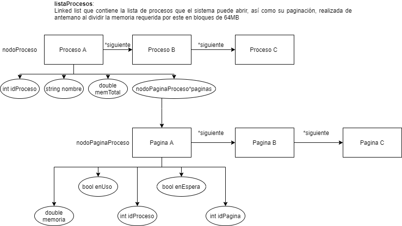

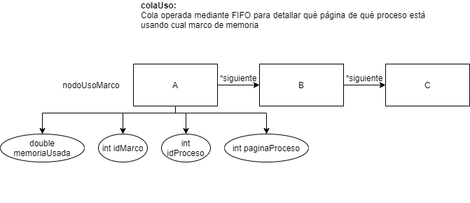

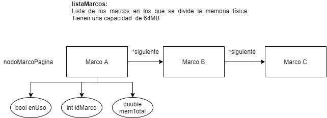

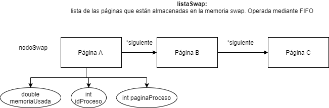

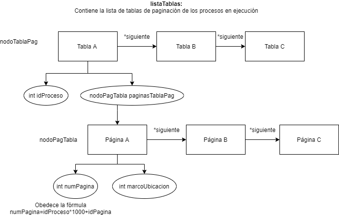

Funcionamiento:

-   **Inicialización**

    1.  Agregar los procesos a listaProcesos,

    2.  Basado en la memoria de cada proceso, crear cuantas páginas de 64MB sean
        necesarias, y si hay un residuo, se crea una página extra para
        este(incluso si es solo 1MB)

    3.  Insertar 16 marcos de memoria en listaMarcos, de 64MB cada uno, para
        llegar a 1024 MB de capacidad

    4.  Declarar una variable global con la capacidad máxima del espacio
        swap(2048MB, lo que debería permitir tener al menos 32 páginas)

-   **Abrir proceso**

    1.  ¿Proceso existe?

        1.  Si no, abortar operación

    2.  ¿Proceso ya está abierto?

        1.  Si es el caso, abortar operación

    3.  De la cantidad total de páginas del proceso, definir un número aleatorio
        de páginas por cargar en memoria(para otorgar un poco más de dinamismo a
        la maqueta)

    4.  Consultar la cantidad de marcos disponibles

        1.  Si marcos disponibles \< páginas a iniciar

            1.  De acuerdo con FIFO, se sacan tantas páginas de colaUso como sea
                necesario, y se revisa cuales marcos se van liberando, para
                actualizar listaMarcos

            2.  Se insertan las páginas sacadas de colaUso en memSwap

                1.  Si swap disponible \< páginas a insertar

                    1.  Revisar cabeza de memSwap, y el proceso al que pertenece

                    2.  Liberar dicho proceso de memSwap, colaUso y tablasPag;
                        además de actualizar listaMarcos(porque el proceso
                        podría tener algunas páginas en memoria principal)

                    3.  Informar que el proceso ha crasheado

                    4.  Repetir esto hasta que se pueda insertar las páginas que
                        estaban en colaUso

            3.  Se cambia la propiedad marcoUbicación de la página en la tabla
                de páginas correspondiente por un -1, indicando que no está en
                memoria física, sino en swap

    5.  Se genera una lista de las páginas por abrir, cuyo tamaño es el número
        aleatorio generado en el paso c, además se revisa que las páginas sean
        únicas

    6.  Se insertan las páginas en colaUso, y se crea una tabla de páginas para
        el proceso, además, se actualiza listaMarcos

-   **Lista de procesos(disco)**

    1.  Se recorre listaProcesos y se imprime una tabla que contiene su id,
        nombre, memoria, así como un detalle de las páginas en las que está
        dividido, y las propiedades de cada una de ellas(id, espacio en disco,
        si están en uso, o si están en espera, es decir, en swap).

-   **Ver marcos**

    1.  Se recorre listaMarcos y se imprime una tabla que contiene su
        id(dirección física), memoria(que en todos los casos es 64 MB) y si
        están en uso o no

-   **Ver marcos en uso**

    1.  Se recorre colaUso y se imprime una tabla que contiene la dirección
        física, proceso:pagina almacenada, y la memoria en uso, así como la
        memoria total en uso

-   **ver swap**

    1.  Se recorre memSwap y se imprime una tabla que contiene el id de página y
        de proceso, así como la memoria que usa cada página, y la que hay usada
        del total de 2048 MB.

-   **ver tablas de páginas**

    1.  Se recorre tablasPag y se imprimen cuantas tablas haya, con su id de
        proceso en el encabezado y el detalle del número de página y el marco en
        que se encuentra cada una de las páginas de dicha tabla

-   **ver procesos en ejecución(marcos+swap)**

    1.  Se recorre tablasPag y por cada proceso se revisa sus páginas

    2.  Si la página tiene un -1 en la propiedad marcoUbicación, se traduce el
        número de página a id de proceso e id de página y se recorre memSwap en
        busca de coincidencias para obtener la cantidad de memoria usada

    3.  Si no se cumple B, se usa la propiedad marcoUbicación para revisar
        colaUso y obtener la cantidad de memoria en uso

    4.  Se imprime una tabla que muestre la lista de procesos en ejecución y el
        detalle de las páginas que tiene abiertas, así como la ubicación de
        estas(según caso, la dirección física y swap)

-   **Usar procesos**

    1.  ¿Proceso existe?

        1.  Si no, abortar operación

    2.  ¿Proceso está abierto?

        1.  Si no abortar operación

    3.  ¿Cuáles páginas se van a usar?

        1.  Revisar en listaProcesos, y seleccionar una cantidad aleatoria del
            total(cuales se escoge también es aleatorio).

        2.  Basado en el tamaño de la página, se genera la palabra a acceder de
            forma aleatoria(cada palabra tiene un tamaño de 128 KB, así que una
            página de 64 MB tiene 512 de estas)

        3.  El id de proceso se multiplica \*1000 y se le suma el id de página
            para crear el número de página

        4.  Se ensambla la dirección lógica en formato num_pagina:palabra(y se
            informa)

        5.  Se recorre la tabla de páginas correspondiente

            1.  Si una de las páginas de esta no se va a usar, se borra de ahí,
                de la memoria swap(si aplica), de la colaUso y se actualiza el
                estado de listaMarcos

            2.  Si se encuentra coincidencias del número de página de la
                dirección lógica, se revisa su ubicación

                2.  Si esta es -1, se genera un fallo de página,se va a memSwap,
                    saca la página de ahí y la inserta en la memoria
                    principal(colaUso), además actualiza su estado en
                    listaMarcos(debe dejar de recorrer la lista para poder
                    modificarla). Si es necesario, envía páginas de colaUso a
                    memSwap o crashea algún proceso(en caso extremo).

                3.  Si el caso A no se cumple entonces marcoUbicacion se combina
                    con la palabra a acceder para formar la dirección física, en
                    formato marcoUbicacion:palabra

                4.  Se imprime un mensaje que indica que se ha accedido a dicha
                    dirección física

            3.  Si una de las páginas a usar no existe en la tabla de
                paginación, se genera un fallo de página(el cual se informa en
                pantalla) luego, busca la página y la inserta en colaUso. Si es
                necesario, envía páginas de colaUso a swap o crashea algún
                proceso(en caso extremo)

-   **Cerrar procesos**

    1.  ¿Proceso existe?

        1.  Si no, abortar operación

    2.  ¿Proceso está abierto?

        1.  Si no, abortar operación

    3.  Recorrer la tabla de páginas e ir liberando los espacios en memSwap y
        colaUso(así como en listaMarcos), luego borrar la tabla de páginas

    4.  Recorrer memSwap y enviar cuantas páginas sea posible a colaUso.
        Actualizar la tabla de páginas para indicar la nueva ubicación, así como
        listaMarcos.

**Demostración**

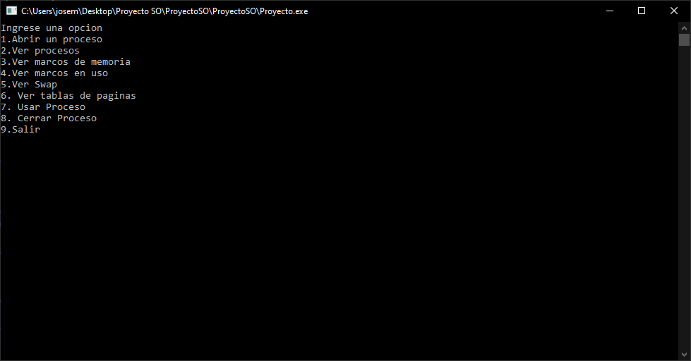

1.  Abrir un proceso (Sirve para seleccionar el proceso que se desea abrir)

2.  Ver procesos (Muestra lista de procesos disponibles)

3.  Ver marcos de memoria (Muestra lista de Marcos de memoria disponibles)

4.  Ver marcos en uso (Muestra los marcos asignados a un proceso)

5.  Ver swap (Muestra lista de proceso que se encuentran en Swap)

6.  Ver tablas de páginas (Muestra la lista de tablas de paginación de los
    procesos en ejecución)

7.  Usar Proceso (Sirve para seleccionar proceso a Usar)

8.  Cerrar Proceso

9.  Salir (Cerrar aplicación)

Pasos

1.  Seleccionamos la opción 2 del menú para ver los procesos disponibles

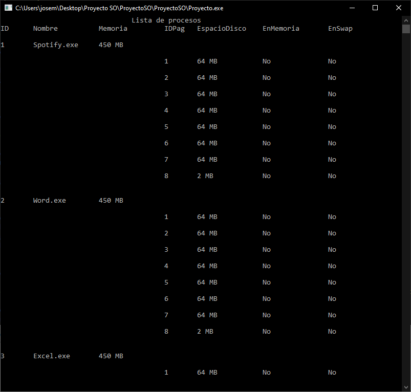

1.  Volvemos al menú principal y seleccionamos la opción 3 para ver marcos de
    memoria

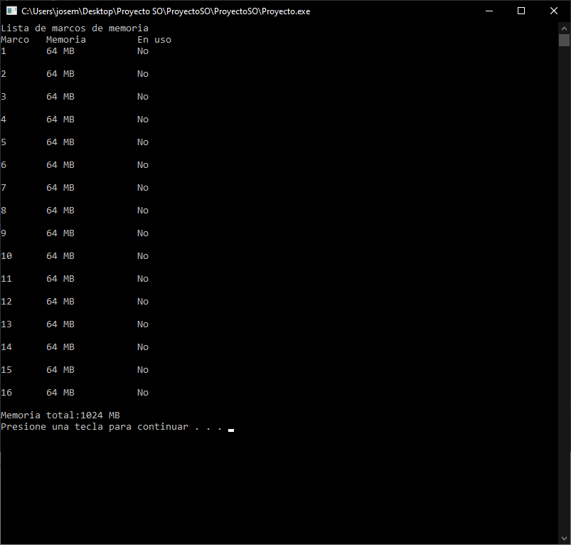

1.  Volvemos al menú principal y seleccionamos opción 1 para abrir un proceso
    (este paso lo repetimos hasta que veamos que fue necesario pasar paginas al
    swap)

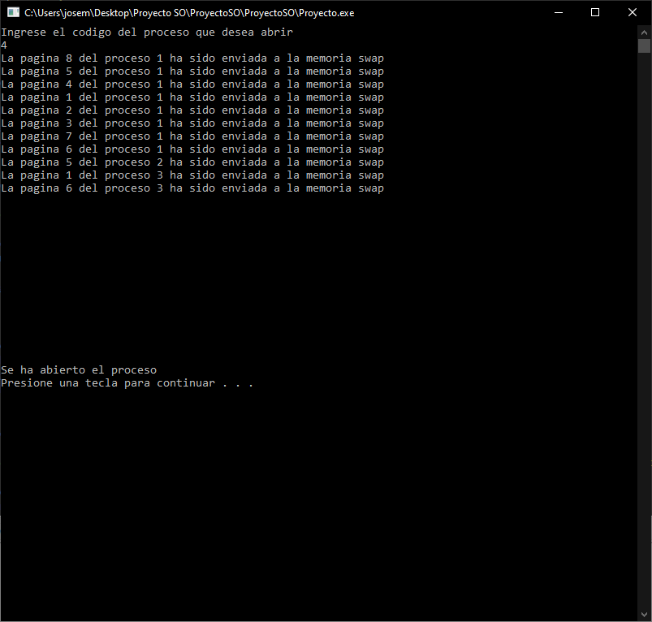

1.  Volvemos a seleccionar la opción 3 en el menú principal para ver la lista de
    marcos de memoria y ahora vamos a ver que todos se encuentran en uso.

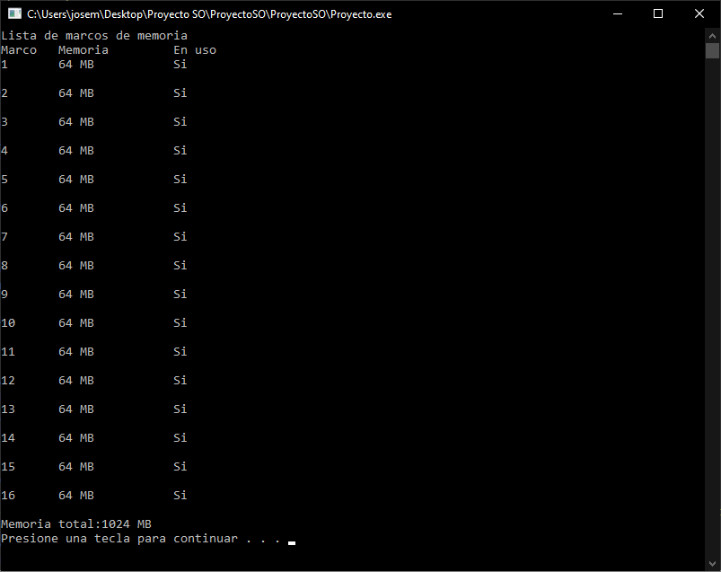

1.  Seleccionamos la opción 4 en el menú principal para ver los marcos en uso,
    nos muestra además la memoria en uso

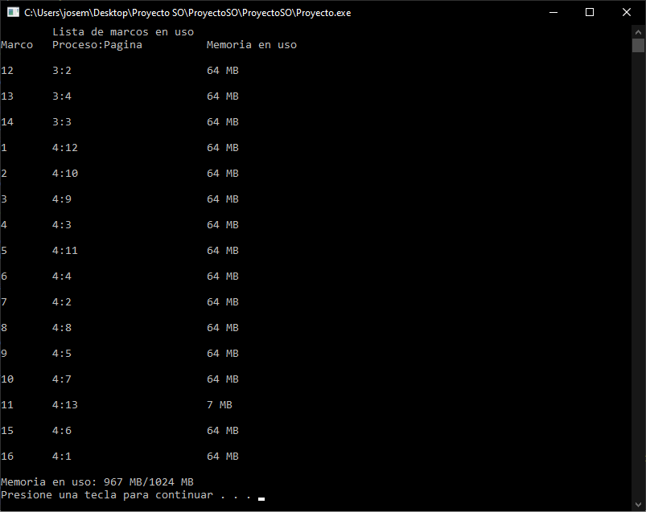

1.  Seleccionamos la opción 5 del menú principal para ver que se encuentra en
    Swap

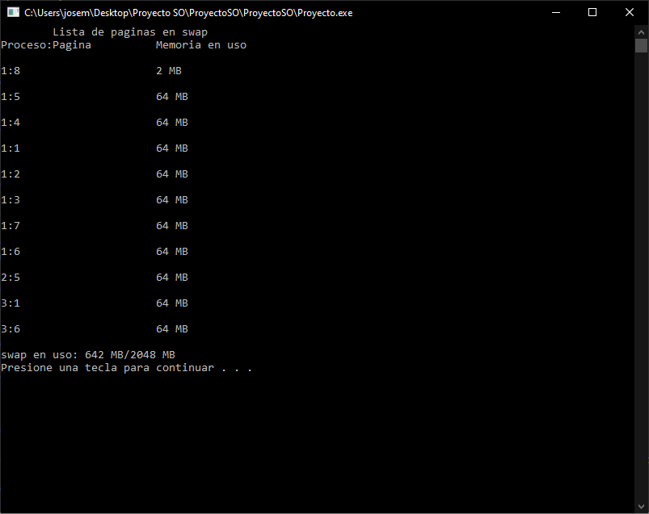

1.  Seleccionamos la opción 7 del menú principal para ver tablas de paginas,
    aquí podemos ver cuales procesos se encuentran abiertos, si el Marco muestra
    un -1 significa que la pagina de el proceso en específico se encuentra en
    Swap.

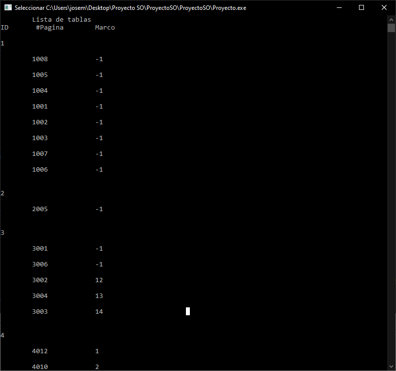

1.  Seleccionamos la opción 7 del menú principal para “Ejecutar un proceso”, en
    nuestro caso vamos a elegir el proceso 1. Como podemos ver, fue necesario
    mover procesos a Swap para hacer espacio en la memoria principal, Además se
    nos muestra las direcciones lógicas y direcciones físicas.

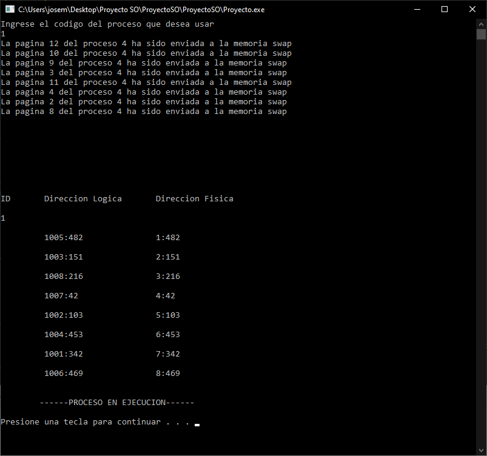

1.  Elegimos la opción 8 del menú principal para cerrar un proceso, en nuestro
    caso vamos a cerrar el proceso 1. Nos indica el nombre del proceso que se
    cerró y además se actualizan las tablas.

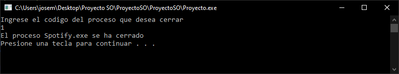

>   En tablas de paginación como podemos ver ya no se muestra el proceso 1

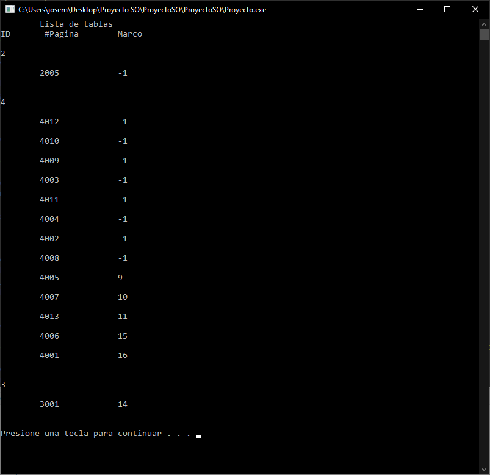

**Referencias**

<https://scoutapm.com/blog/understanding-page-faults-and-memory-swap-in-outs-when-should-you-worry>

<https://www.guru99.com/os-memory-management.html#4>

<https://www.enterprisestorageforum.com/storage-hardware/memory-swapping.html>

<https://www.guru99.com/paging-in-operating-system.html>

<https://www.enterprisestorageforum.com/storage-hardware/paging-and-segmentation.html>

<https://www.gatevidyalay.com/paging-memory-management-operating-system/>

<https://www.geeksforgeeks.org/paging-in-operating-system/>
